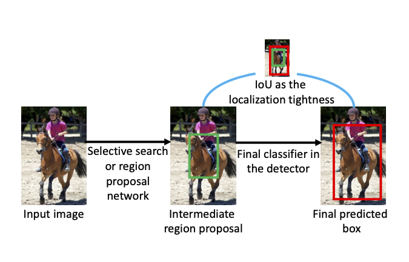
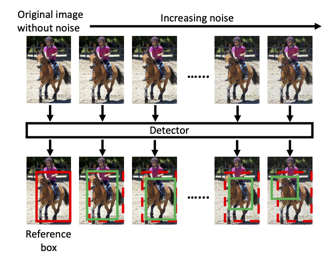
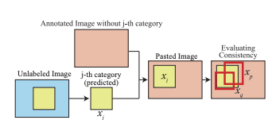

# Active learning for object detection

In chronological order: 

- Deep Bayesian Active Learning with Image Data. PMLR 2017 [[paper](http://proceedings.mlr.press/v70/gal17a/gal17a.pdf)][[code in Keras](https://github.com/Riashat/Deep-Bayesian-Active-Learning)]. **DBAL**
    - Based on BALD, use mutual information between model prediction and model posterior as uncertainty acquisation function (Idea: A sample is selected when the ensemble model is uncertain on average but there exist subsets of models producing diagreeing predictions with high certainty)
    - I(y,w|x, D_train) = H(y|x, D_train) - E_{p(w|D_train)}(H(y|x, w))

- Localization-aware active learning for object detection. Asian Conference on Computer Vision 2018. [[paper](https://arxiv.org/pdf/1801.05124.pdf)] No code
    - Use localization tightness and localization stability as uncertainty measures
    - Localization tightness: IoU overlap between proposals and final predicted bounding boxes 
    - Localization stability: Consistency in prediction when proposals are perturbed by noises 
     
- Towards human-machine cooperation: Self- supervised sample mining for object detection. CVPR 2018. [[paper](https://arxiv.org/pdf/1803.09867.pdf)][[code in Pytorch](https://github.com/yanxp/SSM-Pytorch)] **SSM**
   - Use cross-image consistency (crop and paste) + classification confidence to measure uncertainty 
   - Leverage both high-consistency examples (trust the model's prediction as label) and low-consistency examples (pseudo-label) to complement the traditional uncertainty approach which only focus on high-uncertainty examples 
   - 
- Active learning for convolutional neural network: A core-set approach. ICLR 2018 [[paper](https://arxiv.org/pdf/1708.00489.pdf)][[code in Tensorflow](https://github.com/ozansener/active_learning_coreset)] **Core-set**

- Active learning for deep detection network. ICCV 2019 [[paper](https://arxiv.org/pdf/1911.09168.pdf)][[code in Tensorflow](https://gitlab.com/haghdam/deep_active_learning/-/tree/master)]
- Variational Adversarial Active Learning. ICCV 2019 [[paper](https://openaccess.thecvf.com/content_ICCV_2019/papers/Sinha_Variational_Adversarial_Active_Learning_ICCV_2019_paper.pdf)][[code in Pytorch](https://github.com/sinhasam/vaal)] **VAAL**
- Learning Loss for Active Learning. CVPR 2019 [[paper](https://openaccess.thecvf.com/content_CVPR_2019/papers/Yoo_Learning_Loss_for_Active_Learning_CVPR_2019_paper.pdf)][[code in Pytorch](https://github.com/Mephisto405/Learning-Loss-for-Active-Learning)] **LL4AL**
- Bayesian Generative Active Deep Learning. ICML 2019 [[paper](https://arxiv.org/pdf/1904.11643.pdf)][[code in Pytorch](https://github.com/toantm/BGADL)] **BGADL**

- Contextual Diversity for Active Learning. ECCV 2020 [[paper](https://arxiv.org/pdf/2008.05723)][[code in Pytorch](https://github.com/sharat29ag/CDAL)] **CDAL**
- Towards Fine-grained Sampling for Active Learning in Object Detection. CVPR 2020 workshop [[paper](https://openaccess.thecvf.com/content_CVPRW_2020/papers/w54/Desai_Towards_Fine-Grained_Sampling_for_Active_Learning_in_Object_Detection_CVPRW_2020_paper.pdf)] No code
- State-Relabeling Adversarial Active Learning. CVPR 2020. [[paper](https://openaccess.thecvf.com/content_CVPR_2020/papers/Zhang_State-Relabeling_Adversarial_Active_Learning_CVPR_2020_paper.pdf)] **SRAAL** No code

