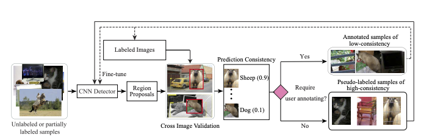
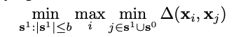
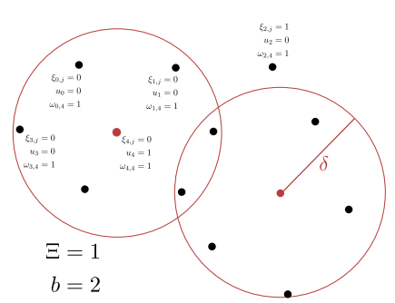
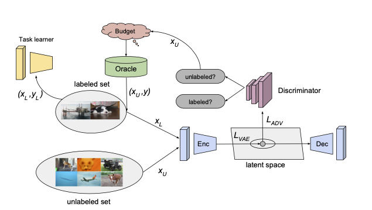
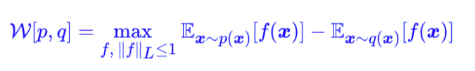

# Active learning for object detection In chronological order

## Uncertainty based

### Unstructured 

- Localization-aware active learning for object detection. Asian Conference on Computer Vision 2018. [[paper](https://arxiv.org/pdf/1801.05124.pdf)] No code
    - Use localization tightness and localization stability as uncertainty measures
    - Localization tightness: IoU overlap between proposals and final predicted bounding boxes 
    - Localization stability: Consistency in prediction when proposals are perturbed by noises 
     
- Towards human-machine cooperation: Self- supervised sample mining for object detection. CVPR 2018. [[paper](https://arxiv.org/pdf/1803.09867.pdf)][[code in Pytorch](https://github.com/yanxp/SSM-Pytorch)] **SSM**
   - Use cross-image consistency (crop and paste) + classification confidence to measure uncertainty 
   - Leverage both high-consistency examples (trust the model's prediction as label) and low-consistency examples (pseudo-label) to complement the traditional uncertainty approach which only focus on high-uncertainty examples 

- Active learning for deep detection network. ICCV 2019 [[paper](https://arxiv.org/pdf/1911.09168.pdf)][[code in Tensorflow](https://gitlab.com/haghdam/deep_active_learning/-/tree/master)]
   - Use consistency of pixel's objectiveness with respect to its neighborhood pixels as uncertainty measure. The formula is very similar to **BALD**, taking the difference between entropy of average and average entropy. 
   - Uncertainty for a image is the average of max-pooled scores
   

- Contextual Diversity for Active Learning. ECCV 2020 [[paper](https://arxiv.org/pdf/2008.05723)][[code in Pytorch](https://github.com/sharat29ag/CDAL)] **CDAL**

- Towards Fine-grained Sampling for Active Learning in Object Detection. CVPR 2020 workshop [[paper](https://openaccess.thecvf.com/content_CVPRW_2020/papers/w54/Desai_Towards_Fine-Grained_Sampling_for_Active_Learning_in_Object_Detection_CVPRW_2020_paper.pdf)] No code

- State-Relabeling Adversarial Active Learning. CVPR 2020. [[paper](https://openaccess.thecvf.com/content_CVPR_2020/papers/Zhang_State-Relabeling_Adversarial_Active_Learning_CVPR_2020_paper.pdf)] **SRAAL** No code

### Structured
- Deep Bayesian Active Learning with Image Data. PMLR 2017 [[paper](http://proceedings.mlr.press/v70/gal17a/gal17a.pdf)][[code in Keras](https://github.com/Riashat/Deep-Bayesian-Active-Learning)]. **DBAL**
    - Based on BALD, use mutual information between model prediction and model posterior as uncertainty acquisation function (Idea: A sample is selected when the ensemble model is uncertain on average but there exist subsets of models producing diagreeing predictions with high certainty)
    - I(y,w|x, D_train) = H(y|x, D_train) - E_{p(w|D_train)}(H(y|x, w))

- Learning Loss for Active Learning. CVPR 2019 [[paper](https://openaccess.thecvf.com/content_CVPR_2019/papers/Yoo_Learning_Loss_for_Active_Learning_CVPR_2019_paper.pdf)][[code in Pytorch](https://github.com/Mephisto405/Learning-Loss-for-Active-Learning)] **LL4AL**
   - Introduce an additional regressor to learn the "loss" of a sample. Then given an unlabelled sample, we can predict its loss without having to know its ground-truth
   - Training is batch-wise, the loss for "loss" requires some contrastive learning

- Bayesian Generative Active Deep Learning. ICML 2019 [[paper](https://arxiv.org/pdf/1904.11643.pdf)][[code in Pytorch](https://github.com/toantm/BGADL)] **BGADL**
   - First use BALD to select informative samples. Then use VAE-ACGAN (as effective data augmentation) to generate new samples that are as informative as the selected one 

   
## Diversity based

- Active learning for convolutional neural network: A core-set approach. ICLR 2018 [[paper](https://arxiv.org/pdf/1708.00489.pdf)][[code in Tensorflow](https://github.com/ozansener/active_learning_coreset)] **Core-set**
   - Diversity-based selection, selected unlabelled data + labelled data should be close to the distribution of all training data. Use K-center to optimize. We are essentially solving . i.e. x_i is random training point, s0+s1 are initial labelled samples + selected unlabelled samples. We want to choose b center points such that the largest distance between a data point and its nearest center is minimized. In other words, s0+s1 has high coverage on the distributions of x_i. 
   
- Variational Adversarial Active Learning. ICCV 2019 [[paper](https://openaccess.thecvf.com/content_ICCV_2019/papers/Sinha_Variational_Adversarial_Active_Learning_ICCV_2019_paper.pdf)][[code in Pytorch](https://github.com/sinhasam/vaal)] **VAAL**
   - Similar to **BGADL**, it trains Beta-VAE-GAN(GAN only has discriminator, no generator) to project image into latent vector then discriminate whether it is labeled/unlabelled. Difference is that **VAAL** is not uncertainty-based, it will select images where the discriminator thinks they are unlabelled images with high confidence. i.e. Select images that are significantly different from labelled images. 

- Deep Active Learning: Unified and Principled Method for Query and Training. PMLR 2020. [[paper](http://proceedings.mlr.press/v108/shui20a/shui20a.pdf)]
   - Similar to the above two SOTA, it tries to make L(labelled)+B(selected unlabelled) --> D(total) by minimizing the Wasserstein distance (EMD distance in continuous case) between D and L+B. It can be shown that [[link](https://blog.csdn.net/c9Yv2cf9I06K2A9E/article/details/86762056)] minimizing Wassertein distance between 2 distribution p and q is equivalent of the following min-max optimization on some function f(.) . Thus we need to solve 
